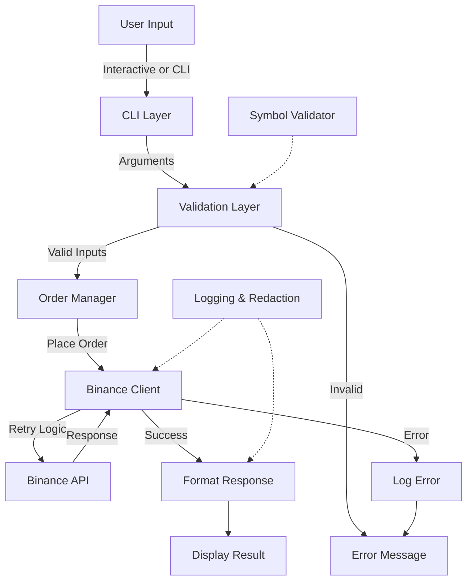
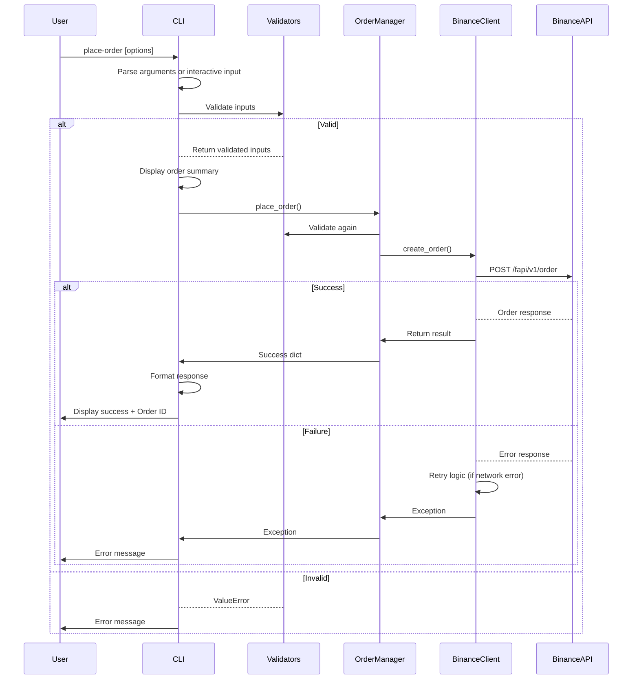

# Trading Bot - Binance Futures Testnet CLI

A production-quality Python CLI for placing orders on **Binance Futures Testnet** (USDT-M).

### What Is This?

This is a command-line trading bot that allows you to place market and limit orders on Binance Futures Testnet. It's perfect for:
- 🧪 Testing trading strategies without real money
- 📚 Learning how to interact with the Binance API
- 🔧 Developing and debugging trading algorithms
- ⚡ Automating repetitive order placement tasks

Built with production-grade code quality: type hints, comprehensive logging, input validation, error handling, and security best practices.

## 📑 Table of Contents

- [Features](#features)
- [Quick Start](#quick-start)
- [Installation](#installation)
- [Usage](#usage)
- [Input Validation](#input-validation)
- [Examples](#examples)
- [Test Commands](#test-commands)
- [Logging](#logging)
- [Design Decisions](#design-decisions)
- [Exit Codes](#exit-codes)
- [Extensibility](#extensibility)
- [Code Quality](#code-quality--production-readiness)
- [Error Handling](#error-handling)
- [Troubleshooting](#troubleshooting)
- [Documentation](#documentation)

## Features

- [x] **Market Orders** - Instant execution at current market price
- [x] **Limit Orders** - Execute at specified price
- [x] **BUY/SELL** - Both order directions supported
- [x] **Interactive Mode** - Friendly CLI prompts for all parameters
- [x] **CLI Arguments** - Direct order placement via command line
- [x] **Input Validation** - Clear error messages for invalid inputs
- [x] **Detailed Logging** - Request/response logging to `logs/bot.log`
- [x] **Professional Output** - Formatted tables and status indicators
- [x] **Error Handling** - Comprehensive exception handling and recovery
- [x] **Secret Redaction** - Automatically masks API keys in logs
- [x] **Live Symbol Validation** - Validates symbols against Binance API
- [x] **Production-Ready Code** - Type hints, docstrings, and best practices

## Architecture Diagram



## Order Placement Flow



## Project Structure

```
Trade_bot/
├── bot/
│   ├── __init__.py              # Package initialization
│   ├── cli.py                   # CLI interface with argparse
│   ├── client.py                # Binance Futures Testnet wrapper
│   ├── orders.py                # Order placement logic
│   ├── validators.py            # Input validation
│   ├── symbol_validator.py      # Live symbol validation
│   ├── config.py                # Centralized configuration
│   ├── logging_config.py        # Logging setup
│   └── logging_filter.py        # Secret redaction
├── docs/
│   └── ARCHITECTURE.md          # Technical architecture & design
├── logs/
│   └── bot.log                  # Log file (auto-created)
├── cli.py                       # Entry point script
├── .env                         # API credentials (not in git)
├── requirements.txt             # Python dependencies
└── README.md                    # This file
```

## Quick Start

**1. Install dependencies:**
```bash
pip install -r requirements.txt
```

**2. Configure API credentials in `.env`:**
```
API_KEY=your_testnet_api_key
API_SECRET=your_testnet_api_secret
```
Get testnet credentials from: https://testnet.binancefuture.com/en/usersCenter

**3. Run the bot:**
```bash
# Interactive mode (recommended for first-time users)
python cli.py place-order

# Or direct CLI command
python cli.py place-order --symbol BTCUSDT --side BUY --type MARKET --qty 0.01
```

Note: Make sure the virtual environment is activated first (see Installation section).

## Installation

### System Requirements

- **Python** 3.8 or higher
- **pip** (Python package manager)
- **Internet connection** (for Binance API access)
- **Windows, macOS, or Linux**

### 1. Clone or navigate to project directory

```bash
cd Trade_bot
```

### 2. Create and activate virtual environment (recommended)

**Windows:**
```bash
python -m venv venv
venv\Scripts\activate
```

**macOS/Linux:**
```bash
python3 -m venv venv
source venv/bin/activate
```

### 3. Install dependencies

```bash
pip install -r requirements.txt
```

### 4. Configure API credentials

Edit `.env` file with your Binance Testnet API keys:

```
API_KEY=your_api_key_here
API_SECRET=your_api_secret_here
```

**To get Testnet credentials:**
1. Visit: https://testnet.binancefuture.com/en/usersCenter
2. Go to API Management
3. Create new key
4. Copy API Key and Secret Key to `.env`

> [WARNING] **Important**: Never commit `.env` file to version control. Keep credentials secure.

## Usage

### Command Structure

```bash
python cli.py place-order [OPTIONS]
```

### Interactive Mode (Recommended for beginners)

Run without arguments for interactive prompts:

```bash
python cli.py place-order
```

Output:
```
========================================
            PLACE ORDER
========================================
Enter symbol (e.g., BTCUSDT): BTCUSDT
Enter side (BUY/SELL): BUY
Enter order type (MARKET/LIMIT): MARKET
Enter quantity: 0.01

===================================
       ORDER SUMMARY
===================================
Symbol     : BTCUSDT
Side       : BUY
Type       : MARKET
Quantity   : 0.01

===================================
        RESPONSE
===================================
Order ID        : 123456789
Status          : FILLED
Executed Qty    : 0.01
Average Price   : 59850.00

[SUCCESS] Order placed successfully
```

### Command Line Mode

**Market Buy Order:**
```bash
python cli.py place-order --symbol BTCUSDT --side BUY --type MARKET --qty 0.01
```

**Limit Sell Order:**
```bash
python cli.py place-order --symbol ETHUSDT --side SELL --type LIMIT --qty 1.0 --price 2500
```

### Help & Documentation

```bash
python cli.py --help
```

Shows all available commands and options.

```bash
python cli.py place-order --help
```

Shows options for `place-order` command:
```
options:
  -h, --help            show this help message and exit
  --symbol SYMBOL       Trading symbol (e.g., BTCUSDT)
  --side SIDE           Order side: BUY or SELL
  --type ORDER_TYPE     Order type: MARKET or LIMIT
  --qty QTY             Order quantity
  --price PRICE         Order price (required for LIMIT orders)
```

## Input Validation

The bot validates inputs and provides helpful error messages:

| Input | Rule | Error Message |
|-------|------|---------------|
| Symbol | Must end with USDT | "Symbol must end with USDT (e.g., BTCUSDT)" |
| Side | Must be BUY or SELL | "Side must be BUY or SELL" |
| Type | Must be MARKET or LIMIT | "Order type must be MARKET or LIMIT" |
| Quantity | Must be positive | "Quantity must be positive" |
| Price (LIMIT) | Required for LIMIT orders | "Price is required for LIMIT orders" |
| Price | Must be positive | "Price must be positive" |

Example:
```bash
python cli.py place-order --symbol BTCUSDT --side INVALID
```
Output:
```
[ERROR] Order failed: Side must be BUY or SELL
```

## Examples

### 1. Market Buy Bitcoin

```bash
python cli.py place-order --symbol BTCUSDT --side BUY --type MARKET --qty 0.01
```

### 2. Limit Sell Ethereum

```bash
python cli.py place-order --symbol ETHUSDT --side SELL --type LIMIT --qty 1 --price 2500
```

### 3. Interactive Market Order

```bash
python cli.py place-order
# Follow prompts...
```

### 4. Invalid Input Handling

```bash
python cli.py place-order --symbol BTCUSDT --side BUY --type LIMIT --qty 0.01
```
Output (missing price):
```
[ERROR] Order failed: Price is required for LIMIT orders
```

## Test Commands

Use these commands to verify your setup is working correctly:

### 1. Test Help Command
```bash
python cli.py --help
```
Expected: Shows main command help with available subcommands

### 2. Test Place-Order Help
```bash
python cli.py place-order --help
```
Expected: Shows all available options for place-order command

### 3. Test Input Validation (Invalid Side)
```bash
python cli.py place-order --symbol BTCUSDT --side INVALID --type MARKET --qty 0.01
```
Expected: `[ERROR] Order failed: Side must be BUY or SELL`

### 4. Test Input Validation (Missing Price for LIMIT)
```bash
python cli.py place-order --symbol BTCUSDT --side BUY --type LIMIT --qty 0.01
```
Expected: `[ERROR] Order failed: Price is required for LIMIT orders`

### 5. Test Invalid Symbol
```bash
python cli.py place-order --symbol BTC --side BUY --type MARKET --qty 0.01
```
Expected: `[ERROR] Order failed: Symbol must end with USDT (e.g., BTCUSDT)`

### 6. Test Invalid Quantity
```bash
python cli.py place-order --symbol BTCUSDT --side BUY --type MARKET --qty -0.01
```
Expected: `[ERROR] Order failed: Quantity must be positive`

### 7. Test Valid MARKET Order (requires API keys)
```bash
python cli.py place-order --symbol BTCUSDT --side BUY --type MARKET --qty 0.01
```
Expected: [SUCCESS] Order placed successfully with Order ID

### 8. Test Valid LIMIT Order (requires API keys)
```bash
python cli.py place-order --symbol ETHUSDT --side SELL --type LIMIT --qty 1.0 --price 2500
```
Expected: [SUCCESS] Order placed successfully with Order ID or API error (if testnet down)

### 9. Test Interactive Mode
```bash
python cli.py place-order
```
Expected: Prompts for symbol, side, type, quantity, and price (if LIMIT)

### 10. View Logs

**Windows:**
```bash
Get-Content logs/bot.log -Tail 20
```

**macOS/Linux:**
```bash
tail -f logs/bot.log
```

Expected: Recent log entries showing order attempts and API calls

## Logging

All requests, responses, and errors are logged to `logs/bot.log`:

```
2026-04-03 10:30:45 - trading_bot - INFO - Placing order - Symbol: BTCUSDT, Side: BUY, Type: MARKET, Qty: 0.01
2026-04-03 10:30:46 - trading_bot - DEBUG - Creating MARKET order with params: {...}
2026-04-03 10:30:47 - trading_bot - DEBUG - Order created successfully: {...}
2026-04-03 10:30:47 - trading_bot - INFO - Order placed successfully - ID: 123456789, Status: FILLED
```

Log rotation is configured:
- Max file size: 5MB
- Backup copies: 5 files
- Old logs automatically archived

### Request ID Tracking

Every order operation generates a unique request ID for debugging and tracing:

```
[req_id=abc12345] Creating MARKET order - Symbol: BTCUSDT, Qty: 0.01
[req_id=abc12345] Order created successfully - Order ID: 123456
[req_id=abc12345] Order placed successfully - ID: 123456, Status: NEW
```

All logs for a single order operation share the same `req_id` for easy correlation and debugging.

---

## Design Decisions

### Why Layered Architecture?
- **Separation of Concerns**: Each layer has a single responsibility
  - CLI layer handles user interaction
  - Validators handle input checking
  - OrderManager orchestrates the flow
  - BinanceClient handles API communication
- **Testability**: Easy to test each layer independently
- **Maintainability**: Changes to one layer don't affect others
- **Scalability**: Easy to add new features (e.g., new order types, new exchanges)

### Why Centralized Validation?
- **Consistency**: All inputs validated the same way
- **User Experience**: Clear, actionable error messages
- **Performance**: Validation before API calls saves bandwidth and rate limits
- **Security**: Prevents invalid requests from reaching the API

### Why Comprehensive Logging?
- **Debugging**: Full request/response trace for troubleshooting
- **Auditing**: All orders logged with timestamps and request IDs
- **Monitoring**: Track API calls and errors over time
- **Compliance**: Trading records available for review

---

## Exit Codes

The bot uses standard exit codes for scripting and automation:

| Code | Meaning | Example |
|------|---------|---------|
| 0 | Success | Order placed successfully, help displayed |
| 1 | Failure | Validation error, API error, missing credentials |

**Example (PowerShell):**
```powershell
python cli.py place-order --symbol BTCUSDT --side BUY --type MARKET --qty 0.01
if ($LASTEXITCODE -eq 0) {
    Write-Host "[SUCCESS] Order succeeded"
} else {
    Write-Host "[ERROR] Order failed"
}
```

**Example (Bash):**
```bash
python cli.py place-order --symbol BTCUSDT --side BUY --type MARKET --qty 0.01
if [ $? -eq 0 ]; then
    echo "[SUCCESS] Order succeeded"
else
    echo "[ERROR] Order failed"
fi
```

---

## Extensibility

The architecture is designed for easy expansion:

### Adding New Order Types

**Current:** MARKET, LIMIT

**To add:** Stop-Loss, Take-Profit, OCO (One-Cancels-Other)

**Implementation:**
1. Add validation in `bot/validators.py`
2. Update `bot/orders.py` to handle new type
3. Add CLI option in `bot/cli.py`
4. Update documentation

### Adding New Exchanges

**Current:** Binance Futures Testnet

**To add:** Coinbase, Kraken, Bybit, etc.

**Implementation:**
1. Create `bot/exchanges/binance.py`, `bot/exchanges/coinbase.py`
2. Implement common exchange interface
3. Switch exchange in `bot/config.py`
4. Reuse validation and order logic

### Adding New Input Modes

**Current:** Interactive, CLI arguments

**To add:** Configuration files, REST API server

**Implementation:**
1. Add new input handler in `bot/cli.py`
2. Reuse existing validation and order placement logic
3. Results already structured for multiple output formats

---

## Code Quality & Production Readiness

This project is built to production standards:

- [x] **Type Hints** - Full type annotations throughout
- [x] **Docstrings** - Comprehensive documentation on all functions
- [x] **No Hardcoded Values** - All constants in `bot/config.py`
- [x] **Request ID Tracking** - Unique ID per operation for debugging
- [x] **Retry Logic** - Network resilience for failed API calls
- [x] **Structured Logging** - Readable, queryable logs with rotation
- [x] **Error Handling** - Graceful failure with clear messages
- [x] **Exit Codes** - Standard codes for integration with other tools
- [x] **Secret Management** - No credentials in code or logs
- [x] **Testing Commands** - Comprehensive test commands provided

---

## Testnet vs Mainnet

This bot is configured for **Binance Futures Testnet**:
- Base URL: `https://testnet.binancefuture.com`
- **NO real funds used** - Safe for testing and development
- Perfect for learning and testing order placement logic
- Credentials kept separate from mainnet

To use **Mainnet** (real trading with actual funds):
1. Get mainnet API keys from https://www.binance.com (not testnet)
2. Modify `bot/client.py` and set `testnet=False`:
   ```python
   self.client = Client(
       api_key=api_key,
       api_secret=api_secret,
       testnet=False  # Change from True
   )
   ```
3. Update `.env` with mainnet credentials
4. **⚠️ CAUTION**: Real money at risk - test thoroughly before deploying

> **Recommendation**: Always test on testnet first before attempting real trading.

## Error Handling

The bot gracefully handles:

- **Invalid CLI arguments** → Shows helpful error message
- **Invalid API credentials** → Fails at startup with clear message
- **Network issues** → Logs error and fails gracefully
- **Binance API errors** → Captures error code and message
- **Missing parameters** → Validates before sending to API

## Development & Testing

### Run with verbose logging

Add debug output by modifying `logging_config.py`:
```python
console_handler.setLevel(logging.DEBUG)  # Change from ERROR
```

### Check logs

```bash
tail -f logs/bot.log
```

### Test invalid inputs

```bash
python cli.py place-order --symbol INVALID --side BUY --type MARKET --qty 0.01
# Error: Symbol must end with USDT (e.g., BTCUSDT)
```

## Dependencies

- **python-binance** - Official Binance API wrapper
- **python-dotenv** - Environment variable management

View versions in `requirements.txt`

## Troubleshooting

### "API_KEY and API_SECRET must be set in .env file"

**Solution:** Check `.env` file exists and contains valid credentials:
```bash
cat .env
```

### "ModuleNotFoundError: No module named 'binance'"

**Solution:** Install dependencies:
```bash
pip install -r requirements.txt
```

### Connection timeout

**Solution:** Check internet connection. Testnet may occasionally be down.

### "Order failed: Invalid quantity"

**Solution:** Ensure quantity matches trading pair requirements (e.g., BTC minimum is often 0.001)

## Notes

- Testnet is reset periodically; starting balance is 10,000 USDT
- Orders on testnet have minimal/no latency impact
- Demo only - not for real trading
- Always test thoroughly before using mainnet

## License

This project is provided as-is for educational and testing purposes.

## Support

For issues with:
- **Bot code** - Check issue tracker or see [docs/](docs/)
- **Binance API** - See https://binance-docs.github.io/apidocs/
- **python-binance** - See https://github.com/sammchardy/python-binance

## Documentation

Complete architecture documentation available in [docs/ARCHITECTURE.md](docs/ARCHITECTURE.md) - includes system design, components, and data flow diagrams.

For detailed information on setup, testing, and troubleshooting, see the sections below.
